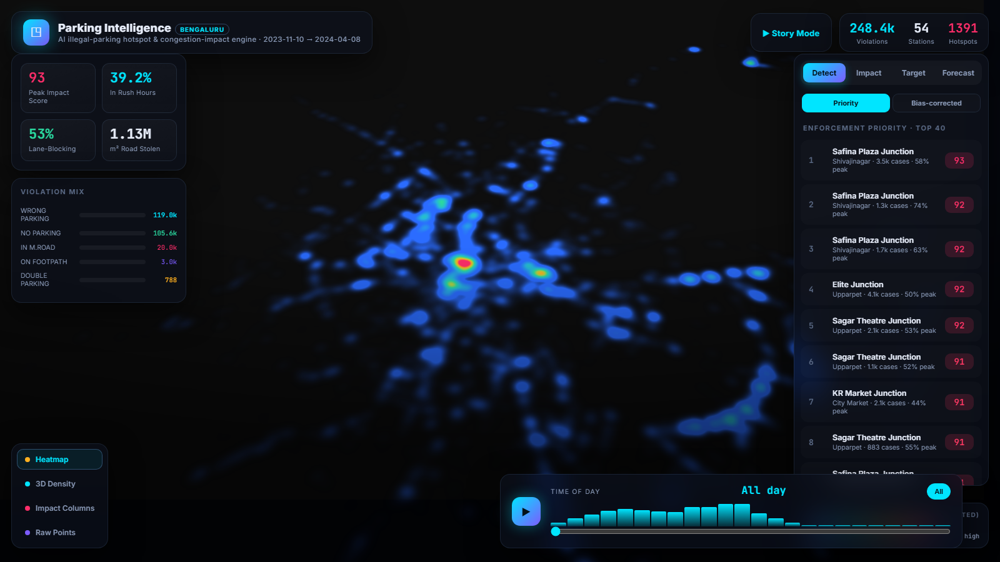
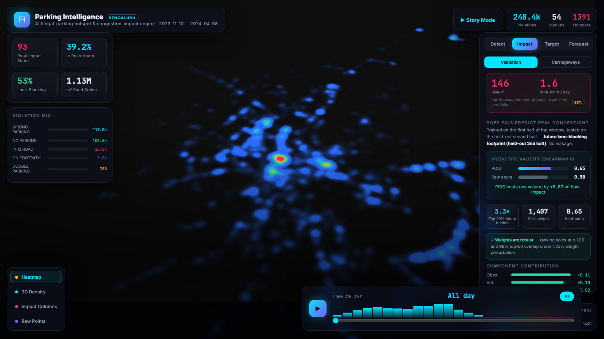
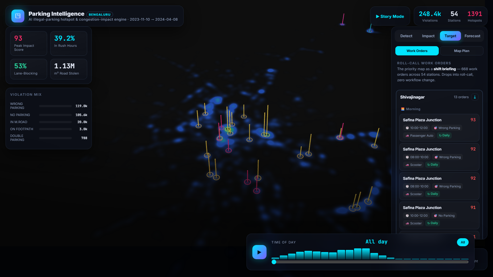
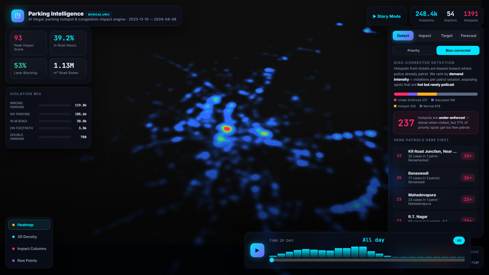
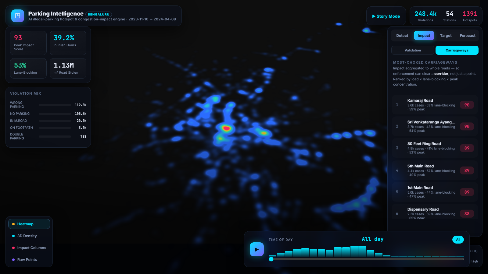

<div align="center">

# Parking Intelligence

**Detecting illegal-parking hotspots, scoring their impact on traffic flow, and turning both into targeted enforcement — from 298,450 real Bengaluru enforcement records.**


### [▶ Live demo — parking-intelligence.vercel.app](https://parking-intelligence.vercel.app/)



</div>

---

## Overview

Parking Intelligence is an analytics-and-decision system for on-street parking
enforcement. It ingests anonymized police parking-violation records, locates where
illegal parking concentrates, scores how much each location degrades traffic flow,
and emits an operational plan — per-station, per-shift work orders that a control
room can act on. The full pipeline runs on the provided dataset alone; no external
or live feeds are required.

Built for **Problem Statement 1 — Poor Visibility on Parking-Induced Congestion**:
*detect illegal-parking hotspots and quantify their impact on traffic flow to enable
targeted enforcement.*

**Dataset:** 298,450 parking-enforcement records · Bengaluru · Nov 2023 – Apr 2024 ·
54 police stations.

---

## Features

### 1 · Hotspot detection, corrected for patrol bias
Violations are indexed to H3 hexagons and ranked into 1,391 hotspot cells. Because
enforcement records are biased toward where police already patrol, the system also
ranks by **yield per patrol visit** (violations caught per session) — separating
genuinely dense locations from heavily-patrolled ones, and surfacing **234
under-enforced** spots that are busy but rarely policed.

### 2 · Parking Congestion Impact Score (PCIS)
A per-location impact score that combines carriageway occupancy, road criticality,
junction proximity, peak-hour concentration and chronicity. Impact is also rolled up
to **whole carriageways** (45 ranked roads) so a corridor can be cleared end-to-end
rather than a single point. PCIS is translated into a tangible unit — an estimated
**~146 lane-metres of carriageway blocked at peak**.



### 3 · Targeted-enforcement work orders
A coverage optimizer turns the priority map into **668 roll-call work orders** across
54 stations. Each order specifies location, the violation type and vehicle class to
target, the peak time window, an expected lane-metre impact, and a data-derived
**revisit cadence** (from the observed recurrence interval). Every station's briefing
exports to CSV.



### 4 · Next-7-day hotspot forecast
A gradient-boosted ensemble ranks each cell by its expected parking load over the
coming week, so units can be positioned before congestion forms. Validated by
walk-forward evaluation.

### 5 · Interactive 3D command center
A WebGL dashboard (deck.gl + MapLibre) for situational awareness:
- **Extruded 3D impact hexagons** and **PCIS impact columns** over a dark vector map
- **Adaptive rendering** — a clean heatmap when zoomed out, 3D detail on zoom-in
- **24-hour time-lapse** of how hotspots shift across the day
- **Hover inspection**, cinematic fly-to, and a guided **story mode** walkthrough
- Dedicated views for bias-corrected detection, choked carriageways, deployment, and forecast

---

## Results

All figures are computed from the provided dataset only.

**Impact score is validated, not assumed** — built on the first half of the window,
tested on the held-out second half:

| Metric | Result |
| --- | --- |
| PCIS predicts held-out flow-impact (Spearman ρ) | **0.65** |
| Raw-count baseline, same test | 0.58 |
| Future burden of the top-10% PCIS cells | **3.3× average** |
| Weight robustness (ranking ρ under ±25% perturbation) | **0.998** |
| Top-50 stability under perturbation | **97.7%** |
| Per-visit-yield stability across halves (Spearman ρ) | **0.61** |

**Next-7-day forecast** (walk-forward):

| Metric | Result |
| --- | --- |
| ROC-AUC | **0.96** |
| Precision@50 | **64%** |
| NDCG@50 | **0.85** |

**Operational output:** 234 under-enforced hotspots · 45 ranked carriageways ·
668 work orders across 54 stations · ≈146 lane-metres blocked at peak (~1.6 lane-km·h
of road-time lost per day, stated assumptions).

<table>
<tr>
<td width="50%"></td>
<td width="50%"></td>
</tr>
</table>

---

## Architecture

```
 298,450 enforcement records (CSV)
        │
        ├─ pipeline/  (pandas)            local, no GPU
        │     build_artifacts.py   → hotspots · PCIS · detection · corridors · work orders · validation
        │     build_forecast.py    → next-7-day forecast
        │
        ├─ kaggle/    (GPU)               optional heavy compute
        │     01 data engine (H3)
        │     02 PCIS (OSM-enriched)
        │     03 forecast ensemble (XGBoost + LightGBM + CatBoost)
        │     04 deployment optimizer
        │
        ▼
   frontend/public/data/*.json   →   frontend/  (React + deck.gl + MapLibre)
                                        3D command center
```

The dashboard reads pre-built JSON artifacts, so it runs end-to-end without the GPU
step. The Kaggle scripts reproduce and extend those artifacts at full scale.

---

## Tech stack

**Frontend:** React 18 · TypeScript · Vite · deck.gl 9 · MapLibre GL · Framer Motion
**Data / ML:** Python 3.12 · pandas · NumPy · scikit-learn · XGBoost · LightGBM · CatBoost · H3

---

## Getting started

```bash
# 1 — run the dashboard (demo artifacts are committed; no dataset needed)
cd frontend
npm install
npm run dev          # http://localhost:5173
```

```bash
# 2 — (optional) rebuild analytics from the raw dataset
#     place the provided CSVs in the project root, then:
pip install pandas numpy scikit-learn xgboost
python pipeline/build_artifacts.py
python pipeline/build_forecast.py
```

Heavy GPU training is documented in [`kaggle/README.md`](kaggle/README.md).

> The raw CSVs are not committed (the enforcement file is 105 MB, above GitHub's
> limit). The JSON artifacts they produce **are** committed, so the app works
> out of the box.

---

## Project structure

```
.
├── frontend/                 React + deck.gl 3D dashboard
│   ├── src/components/        MapView (deck.gl layers), HUD panels
│   └── public/data/           pre-built JSON artifacts
├── pipeline/                  local pandas analytics → artifacts
├── kaggle/                    GPU scripts (H3, PCIS, forecast ensemble, optimizer)
└── docs/
    ├── METHODOLOGY.md         scoring, validation, assumptions
    └── SUBMISSION.md          submission notes
```

See [`docs/METHODOLOGY.md`](docs/METHODOLOGY.md) for the PCIS formulation, the
validation protocol, the forecast design, and every stated assumption.
